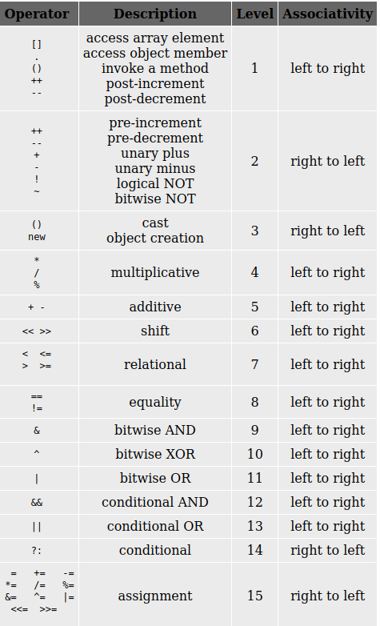

Evaluating an expression is one of the most common tasks in programming. For example, a+b+c is an expression. Here + is an operator. The variables a, b and c are operands. The value of the expression is the sum of a, b and c. An expression may be often evaluated to assign a variable a new value or to verify the truthfulness of a test condition. For example the operator can be unary(Ex: ~, ++ etc.), binary(Ex: +, * etc.) or ternary (Ex: (a>b)?p:q)  

Examples of expressions:

1.  To compute the area of a triangle from base b and height h  
    Area=1/2.0*base*height  
    Note that this expression will be evaluated left to right, that is the division operator will be evaluated, followed by two multiplication operators. The 2.0 is used to make sure that the division is carried out as a floating point operation.
2.  To compute the area of a triangle from the three sides, a, b and c  
    s=(a+b+c)/2.0  
    area = s*(s-a)*(s-b)*(s-c)  
    Here area is calculated in two steps. The first step, s, is computed from the three sides a, b and c. Note that, the parenthesis is used so that evaluation within the parenthesis takes first. Without parenthesis, we would have obtained the value of s as the sum of a, b and half of c. Similarly, parenthesis are very important in evaluating the second expression.
3.  To find the nth term of an arithmetic progression, we can use the following expression  
    tn= a+(n-1)*d  
    where a is the first term and d is the common difference.  
    Here also, the use of parenthesis has helped us in evaluating the expression the way we need it.  
    

An expression used in a computer program is very similar to an algebraic expression and when many operators are specified in an expression, then the evaluation takes place according to the precedence of operators. The order of the precedence is given below.

A parenthesis can be used to override the precedence of operators and force the evaluation of a sub-expression within an expression. Expression is evaluated according to associativity of the operator. The associativity of the operator is a property that determines how operators of the same precedence are grouped in the absence of parenthesis. The objective in evaluating an expression is to consider the precedence and associativity of the individual operators and compute the value of the sub-expressions.

#### Objective

1.  To learn about different types of operators.
2.  To learn about the precedence of the operators.
3.  To learn how to evaluate an expression.

