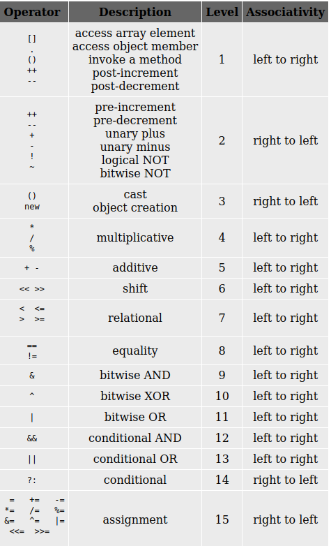

Evaluating expressions is a fundamental task in programming. An expression consists of operands (such as variables or constants) and operators (such as +, \*, %, etc.). The process of evaluation involves parsing the expression, determining the precedence and associativity of operators, and computing the result step by step.

Expressions can be:

- **Arithmetic** (e.g., `a + b * c`)
- **Relational** (e.g., `a > b`)
- **Logical** (e.g., `a && b`)
- **Bitwise** (e.g., `a | b`)
- **Ternary** (e.g., `(a > b) ? p : q`)

#### Examples:

1. **Arithmetic:**
   - `Area = 1/2.0 * base * height` (division and multiplication, floating point ensures correct calculation)
2. **Relational:**
   - `x > y` (checks if x is greater than y)
3. **Logical:**
   - `a && b` (true if both a and b are true)
4. **Bitwise:**
   - `a | b` (bitwise OR operation)
5. **Ternary:**
   - `(a > b) ? p : q` (returns p if a > b, else q)

Operator precedence and associativity determine the order in which operations are performed. Parentheses can be used to override default precedence and force evaluation of sub-expressions first. The following table shows the precedence order of operators:

To evaluate an expression:

1. Parse the expression and identify operands and operators.
2. Apply operator precedence and associativity rules.
3. Compute the value step by step, solving sub-expressions as needed.

Understanding how expressions are evaluated is essential for writing correct and efficient code.
