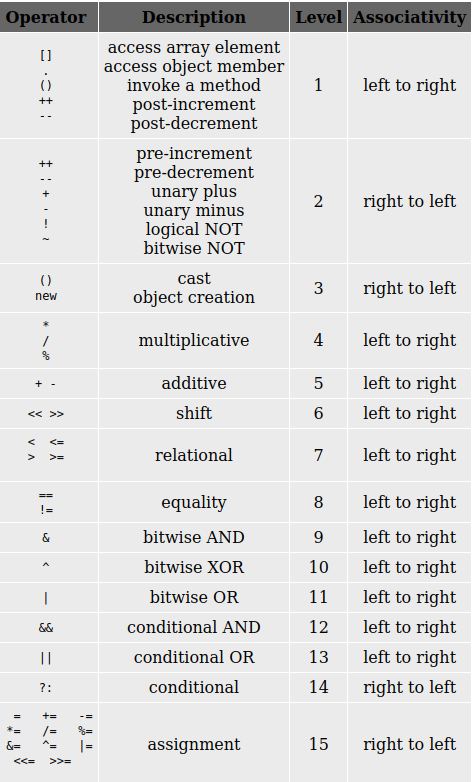

Evaluating an expression involves repeatedly solving the sub-expressions in the lowest level paranthesis and substituting its value to solve the bigger expression. If an expression or sub-expression does not have a paranthesis, then we can directly compute its value based on the precedence and assosciativity of the operators present in the expression. That is, the sub expression involving operator with higher precedence is evaluated before other sub-expressions. The following table gives the precedence order of all the operators:  

  

Operators can be broadly categorized as:  

1.  Arithmetic Operators: These operators are used for arithmetic operations like addition,subtraction and multiplication. Ex: DIVISION(/),MODULUS OR REMAINDER (%)
2.  Relational Operators: These operators are typically used for comparison of two operands.Ex: GREATER THAN(>),GREATER THAN OR EQUAL TO(>=) etc.
3.  Logical Operators: These operators are used for conducting logical operations like AND,OR. Ex: LOGICAL AND( && ),LOGICAL OR (||) etc.
4.  Bitwise Operators: These operators are used to perform operations on bits. Ex: BITWISE AND( & ), BITWISE OR ( | ) etc.
